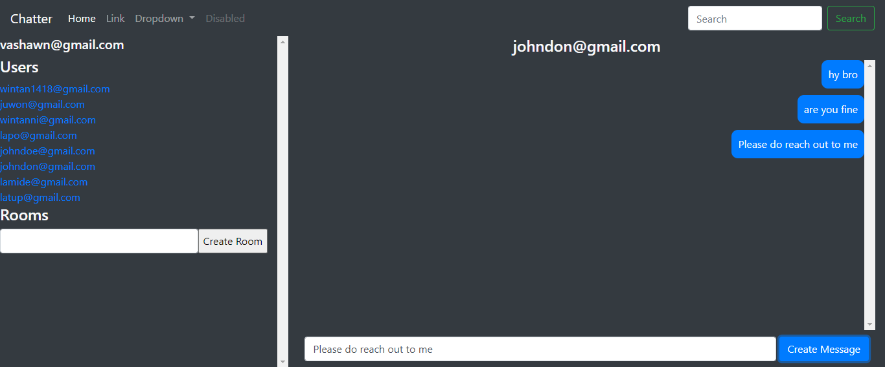

# README

## Getting Started

To get a local copy up and running follow these simple example steps.

- Clone the repository and there you go! ;-)

### Prerequisites

- Get a browser like Chrome and Firefox in their most recent versions
- Code Editor (VSCode)

### Install
to run this project you need to have:
`ruby 3.0.0` or higher
`rails 7.0.0` or higher

### Setup

- Open a terminal and run the command `https://github.com/ek4aa/hometask.git`
- cd hometask
- run `bundle install` to install gemsand dependencies
- run `bin/rails db:migrate RAILS_ENV=development`
- run `npm i`
- run `rails server` to start the server and view on your browser @`localhost:3000`

### Routes for available pages

-localhost:3000/users/signup
-localhost:3000/users/login
-localhost:3000/users/logout
-localhost:3000/rooms
-localhost:3000/rooms/new

## not much functional work done on the views, still building from the back and running in console.

.png)
.png)
